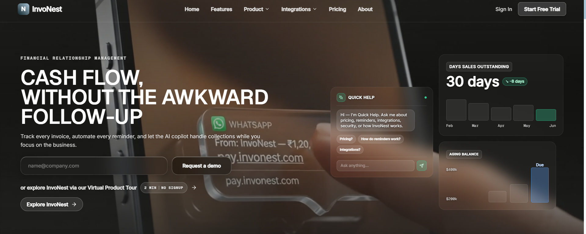
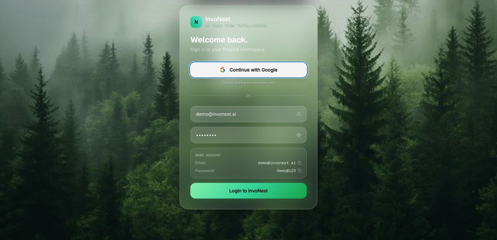
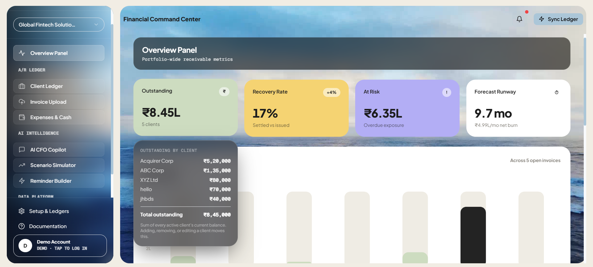
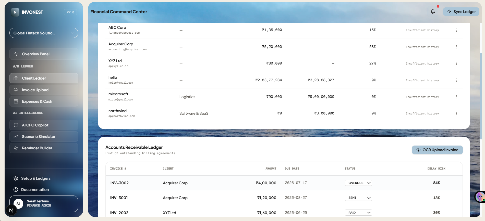

<div align="center">

# 💸 InvoNest

### AI Cash-Flow Intelligence & Invoice Recovery for modern finance teams

**Predict who pays late. Chase invoices automatically. Always know your runway.**

<br/>


</div>

---

## 🧭 What is InvoNest?

InvoNest is an **AI-powered accounts-receivable platform**. It connects to your accounting, CRM, payment and communication tools, learns how each customer pays, and then does the boring, high-stakes work for you: **flagging invoices that are about to go late, running the follow-up sequence, embedding a payment link in every message, and forecasting your cash runway in real time.**

Think of it as an autopilot for collections plus a CFO co-pilot that actually reads your ledger.

---

## 🔥 The Problem

> Most businesses don't fail because they aren't profitable. **They fail because they run out of cash.**

- ⏳ **Late payments** — cash gets trapped in unpaid invoices for weeks.
- 🕳️ **No visibility** — you can't see *when* money is actually arriving, so hiring and spending become guesswork.
- 🔁 **Manual, inconsistent chasing** — finance teams burn hours sending reminders instead of driving strategy.
- 🎲 **Five people, five different runway numbers** — nobody trusts the forecast.

## ✅ The Solution

InvoNest turns accounts receivable from a spreadsheet chore into an intelligent, self-running system:

| Instead of… | InvoNest gives you… |
|---|---|
| Reacting after an invoice is already overdue | **Predictive risk scoring** — a warning *before* the due date |
| Manually emailing every client | **Automated escalation** — email → WhatsApp, on schedule, with a payment link in every message |
| Guessing your cash position | **Real-time runway & cash-flow forecasting** |
| Digging through spreadsheets | An **AI CFO Copilot** you can ask in plain English |
| Copy-pasting invoices | **OCR extraction** — drop a PDF, get structured data |

<h2 align="center">✨ Product Showcase</h2>

<p align="center">
  <b>AI-powered finance platform built for modern businesses.</b>
</p>

<br>

<p align="center">
  
  
  
</p>

<p align="center">
  
  
  
</p>

## 🚀 Why startups love it

- **Free to start** — the Starter plan is ₹0/month for up to 50 active client ledgers.
- **Collections that run themselves** — set it up once; every overdue invoice gets chased automatically.
- **One honest runway number** — instead of five conflicting guesses, board meetings start from a single source of truth.
- **Ask, don't dig** — *"Can we afford to hire two engineers next quarter?"* → get a real answer from your live ledger.
- **Plugs into what you already use** — QuickBooks, Xero, Zoho, Stripe, Razorpay, Gmail, WhatsApp and more.

---

## 🧩 Core Features

| Feature | What it does |
|---|---|
| 📊 **Overview / Liquidity Pulse** | Outstanding, overdue, recovery rate & runway KPIs — computed live from your data |
| 👥 **Client Ledger** | Per-client balances, delay-risk scoring, one-click reminders |
| 🧾 **Invoice OCR Upload** | Extracts invoice data from PDFs/images with high accuracy |
| 🤖 **AI CFO Copilot** | Natural-language chat grounded in your real ledger (report-first, no invented numbers) |
| 🔮 **Scenario Simulator** | Model "what if our biggest client defaults?" style questions (digital twin) |
| ⚡ **Reminder Builder** | Visual escalation workflows — email + WhatsApp with embedded payment links |
| 🛡️ **Risk Engine** | Predicts late-payment probability from historical behaviour |
| 🔌 **Integrations Platform** | OAuth / API connections, background sync, webhooks, encrypted tokens |

---

## 🔗 Integrations

A production-grade integrations platform — OAuth 2.0 (with automatic token refresh) or API keys, encrypted-at-rest credentials, background sync workers and signature-verified webhooks.

| Provider | Category | Auth | Syncs |
|---|---|---|---|
| **QuickBooks Online** | Accounting | OAuth 2.0 | Customers, invoices, outstanding balances, payments |
| **Xero** | Accounting | OAuth 2.0 | Contacts, invoices, payments, credit notes |
| **Zoho Books** | Accounting | OAuth 2.0 | Customers, invoices, payments |
| **Salesforce** | CRM | OAuth 2.0 | Accounts, contacts, opportunities |
| **Stripe** | Payments | API key | Customers, payments, payment intents, invoices |
| **Razorpay** | Payments | API key | Payments, orders, customers |
| **Gmail** | Communication | OAuth 2.0 | Email conversations, reminder history, delivery status |
| **WhatsApp Business** | Communication | Meta Cloud API | Message history, delivery status, read receipts |

> Credentials are **never** stored in source — they live only in gitignored `.env` files and are encrypted (AES-256-GCM) at rest.

---

## 🛠️ Tech Stack

**Frontend** · Next.js 15 (App Router) · React 19 · TypeScript · Tailwind CSS · Framer Motion
**Backend** · NestJS 10 · Prisma 5 · PostgreSQL (PGlite for local dev) · Redis + BullMQ (optional, with a timer fallback)
**AI** · Google Gemini (AI CFO Copilot) · **Email** · Resend
**Architecture** · Clean, modular services · JWT auth (deny-by-default) · rate-limited, structured logging · production-ready OAuth/webhook flows


---

## ⚡ Getting Started

This is an npm-workspaces monorepo (`frontend` + `backend`).

```bash
# 1. Install everything
npm install

# 2. Configure environment (copy the examples, fill in your own keys)
cp backend/.env.example backend/.env
#   frontend also needs: frontend/.env.local
#   (NEXT_PUBLIC_API_URL, NEXT_PUBLIC_GOOGLE_CLIENT_ID)

# 3. Start the local Postgres (PGlite) on :5432
node pg-server.js

# 4. Push the schema
cd backend && npx prisma db push && cd ..

# 5. Run the app (two terminals)
npm run dev:backend     # NestJS API on http://localhost:3001
npm run dev:frontend    # Next.js on   http://localhost:3000
```

Open **http://localhost:3000** — or jump straight into the demo workspace at **/dashboard**.

> ℹ️ The large ambient sidebar video (`frontend/public/rail/rail.mp4`, ~120 MB) is excluded from the repo (GitHub's 100 MB limit). The app runs fine without it; add your own or re-encode a lightweight version.

---

## 🗂️ Project Structure

```
innovest/
├── frontend/            # Next.js 15 app (landing + dashboard)
│   └── app/
│       ├── page.tsx             # marketing landing
│       ├── dashboard/           # the product (overview, clients, copilot, integrations…)
│       └── components/          # shared UI (3D reveals, glass cards, catalog…)
├── backend/             # NestJS API
│   └── src/
│       ├── integrations/        # OAuth, sync engine, webhooks, workers
│       ├── ai-copilot/          # AI CFO Copilot
│       ├── risk-engine/         # late-payment prediction
│       ├── invoices/ clients/ forecasting/ …
│       └── prisma/              # schema & seed
└── pg-server.js         # local PGlite Postgres server
```

---

## 🔒 Security

- Secrets live only in gitignored `.env` files — never committed.
- Integration tokens are encrypted (AES-256-GCM) at rest.
- Webhook endpoints verify provider HMAC signatures and de-duplicate events.
- Every API route is authenticated by default (JWT), opting out only where explicitly public.

---

<div align="center">

**InvoNest** — stop chasing payments, start predicting cash flow.

</div>
